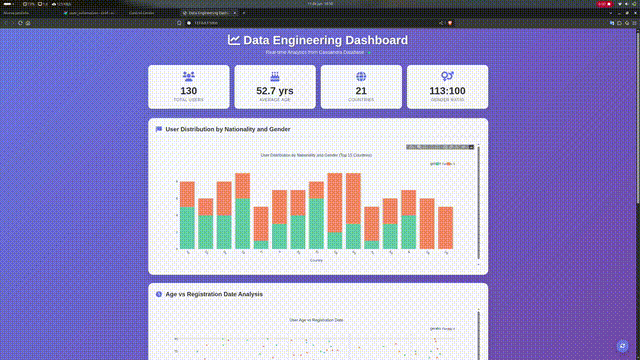
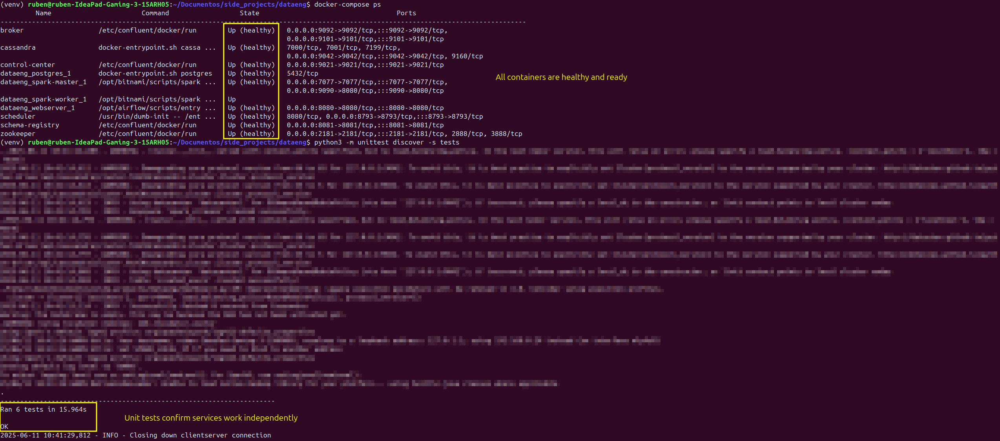
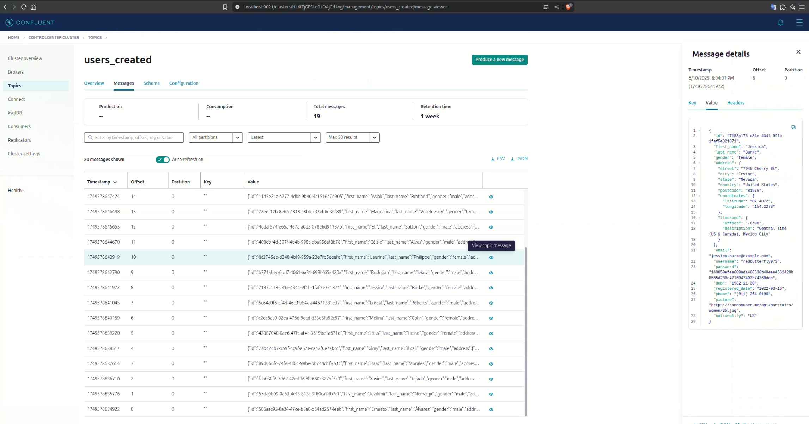

# Ciclo de Vida Completo de Streaming de Datos

## **Resumen**
Este proyecto demuestra el ciclo de vida completo del streaming de datos, desde la ingesta hasta la visualización. Captura datos de usuario desde una API externa, los procesa en tiempo real utilizando **Apache Kafka** y **Apache Spark**, los almacena en una base de datos **Cassandra** y los visualiza a través de un dashboard interactivo construido con **Flask** y **Plotly**. El pipeline está orquestado con **Apache Airflow**, garantizando automatización y confiabilidad.

<p align="center">
  
</p>

El objetivo de este proyecto es mostrar mi capacidad para diseñar, desarrollar y mantener pipelines de datos, al mismo tiempo que proporciono visualizaciones claras e impactantes para la toma de decisiones.

## **Tecnologías Usadas**
-  **Docker Compose**: Gestiona el despliegue de todos los servicios en contenedores aislados para una configuración y escalabilidad sencillas.

-  **Apache Airflow**: Orquesta todo el pipeline, automatizando la ejecución de tareas.

-  **Apache Kafka**: Utilizado para la ingesta y transmisión de datos en tiempo real.

-  **Apache Spark**: Procesa los datos en tiempo real, transformándolos y estructurándolos para su almacenamiento.

-  **Cassandra**: Sirve como capa de almacenamiento para los datos procesados, aprovechando sus capacidades NoSQL distribuidas.

-  **Flask**: Proporciona un framework web ligero para construir el dashboard y los endpoints de la API.

-  **Plotly**: Utilizado para crear visualizaciones de datos interactivas y visualmente atractivas.


## Ejecución

1. **Arranca los servicios con Docker Compose**:
   ```bash
   docker-compose up -d
   ```

2. **Ejecuta las pruebas unitarias**:
   ```bash
   python3 -m unittest discover -s tests
   ```
   

3. **Activa el DAG de Airflow**:
   - Accede a la interfaz de Airflow en [http://localhost:8080](http://localhost:8080).
   - Busca el DAG llamado `kafka_stream` y actívalo para que Kafka comience a recibir datos.
   - Revisa los mensajes que llegan al topic desde el Confluent Control Center en [http://localhost:9021](http://localhost:9021)
      

4. **Inicia el procesamiento de datos en tiempo real con Spark**:
   ```bash
   python3 spark_stream.py
   ```

5. **Conéctate a Cassandra**:
   ```bash
   docker exec -it cassandra cqlsh
   ```

   Comandos útiles dentro de `cqlsh`:
   ```sql
   DESCRIBE KEYSPACES;
   USE spark_streams;
   DESCRIBE TABLES;
   SELECT * FROM created_users LIMIT 10;
   ```

6. **Inicia el dashboard localmente**:
   ```bash
   python3 dashboard.py
   ```

   Luego abre [http://127.0.0.1:5000](http://127.0.0.1:5000) en tu navegador.


## Estructura
   ```bash
dataeng-project/
├── dags/                      # DAGs de Airflow
│   └── kafka_stream.py        
├── script/                   # Scripts de utilidad
│   └── entrypoint.sh         
├── templates/                # Plantillas HTML para Flask
│   └── index.html             
├── tests/                    # Tests unitarios del proyecto
│   ├── test_api_health.py     
│   ├── test_cassandra.py      
│   ├── test_dashboard.py      
│   └── test_spark_stream.py   
├── venv/                     # Entorno virtual
├── dashboard.py              # Aplicación Flask para visualización de datos
├── docker-compose.yml        # Configuración de Docker Compose para los servicios
├── Dockerfile-spark          # Dockerfile para configuración de Spark
├── README.es.md              # Documentación del proyecto en español
├── README.md                 # Documentación del proyecto en inglés
├── requirements.txt          # Dependencias de Python
└── spark_stream.py           # Lógica de Spark Streaming
   ```
