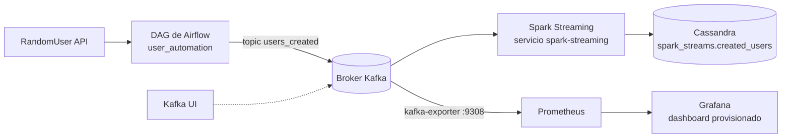

# Ciclo de Vida de Streaming de Datos End-to-End (Edición 2026)

📄 English version available in [README.md](README.md)

[](https://sonarcloud.io/summary/new_code?id=Rubenpombo_end-to-end-data-pipeline)
[](https://github.com/Rubenpombo/end-to-end-data-pipeline/actions/workflows/ci.yml)

## **Resumen**
Este proyecto demuestra una arquitectura profesional de pipeline de datos en tiempo real actualizada a los **estándares de 2026**. Captura datos de usuarios de una API externa, los transmite a través de **Apache Kafka**, los procesa con **Apache Spark Streaming** y almacena los resultados en **Apache Cassandra**.

Todo el stack está contenedorizado con **Docker** (incluido el job de streaming de Spark), orquestado por **Apache Airflow 3.x**, y cuenta con una capa moderna de observabilidad con **Kafka UI**, **Prometheus** y **Grafana**.

## **Demo rápida (5 minutos)**

**Requisitos:** Docker, ~4 GB RAM libres, puertos `8080`, `9092`, `9042`, `3000` y `8000` disponibles.

```bash
git clone https://github.com/Rubenpombo/end-to-end-data-pipeline.git
cd end-to-end-data-pipeline
make up && make ps    # espera a que los servicios estén healthy
```

1. Abre [Airflow](http://localhost:8080) (`admin` / `admin`) → activa el DAG `user_automation` → lanza una ejecución.
2. Abre [Kafka UI](http://localhost:8000) → topic `users_created` → confirma que aparecen mensajes (~2 msg/s durante 120 s).
3. Abre [Grafana](http://localhost:3000) (`admin` / `admin`) → dashboard *Pipeline Overview*.

El servicio `spark-streaming` arranca con el stack y escribe filas en `spark_streams.created_users` (Cassandra). Ejecuta `make test` en cualquier momento para los tests unitarios (no requieren Docker).

## **Arquitectura**


```mermaid
flowchart LR
    API[RandomUser API] --> DAG[DAG de Airflow<br/>user_automation]
    DAG -->|topic users_created| KAFKA[(Broker Kafka)]
    KAFKA --> SPARK[Spark Streaming<br/>servicio spark-streaming]
    SPARK --> CASS[(Cassandra<br/>spark_streams.created_users)]
    KAFKA -->|kafka-exporter :9308| PROM[Prometheus]
    PROM --> GRAF[Grafana<br/>dashboard provisionado]
    KUI[Kafka UI] -.-> KAFKA
```

El DAG de Airflow es una **demo de streaming acotado**: en cada ejecución obtiene usuarios aleatorios y los produce a Kafka durante una ventana de 120 segundos (~2 msg/s). El job de Spark se ejecuta de forma continua como servicio Docker, consumiendo el topic y escribiendo en Cassandra.

### **Contrato de datos**
Todas las capas comparten un único contrato para el topic `users_created`. El campo `address` viaja como **objeto JSON anidado** (street, city, state, country, postcode, coordinates, timezone), Spark lo parsea con el schema struct completo y lo serializa con `to_json()` para que llegue como **cadena JSON** a la columna `address TEXT` de Cassandra.

### **Modelo de datos en Cassandra**
- **Clave primaria:** `id` (UUID de la API origen) — búsquedas puntuales por usuario.
- **Particionado:** una fila por ID de usuario; `SimpleStrategy` con RF=1 solo para demo local.
- **Linaje:** `ingested_at` lo establece Spark en el procesamiento (no forma parte del mensaje Kafka).
- **Patrones de acceso:** inserciones en streaming por ID. Agregaciones por fecha o país requerirían otra partition key o una tabla secundaria — fuera de alcance en esta demo.

## **Arquitectura y Tecnologías**

### **Core Data Stack**
- **Apache Airflow 3.1.7**: Orquestación del pipeline e ingesta de datos desde la API RandomUser.
- **Apache Kafka 7.9 (Confluent)**: Sistema de mensajería distribuida de alto rendimiento.
- **Apache Spark 4.0.2**: Procesamiento de streaming y transformación de datos en tiempo real.
- **Apache Cassandra 5.0**: Base de datos NoSQL distribuida para el almacenamiento final.

### **Observabilidad y Calidad**
- **Kafka UI**: Gestión visual de tópicos, consumidores y mensajes ([localhost:8000](http://localhost:8000)).
- **Prometheus y Grafana**: Recolección de métricas con el dashboard *Pipeline Overview* pre-provisionado ([localhost:3000](http://localhost:3000)).
- **SonarCloud**: Análisis continuo de calidad de código y seguridad.
- **GitHub Actions**: Pipeline de CI/CD automatizado con linting (Ruff) y Pytest.

## **Guía de Ejecución**

Las tareas habituales están encapsuladas en el `Makefile`. Las variables de entorno están documentadas en [`.env.example`](.env.example) — los valores por defecto funcionan sin cambios.

1. **Iniciar la Infraestructura**:
   ```bash
   make up        # equivalente a: docker compose up -d (o docker-compose)
   ```

2. **Verificar el Estado de los Servicios**:
   Espera unos segundos a que todos los servicios estén saludables. Puedes comprobarlo con:
   ```bash
   make ps        # equivalente a: docker compose ps (o docker-compose)
   ```

3. **Ejecutar Tests Automatizados**:
   ```bash
   make test      # tests unitarios (pytest -m "not integration"), mismo subconjunto que CI
   ```
   Los tests de integración requieren el stack levantado y acceso a internet:
   ```bash
   make test-integration
   ```

4. **Activar la Ingesta de Datos (Airflow)**:
   - Accede a Airflow en [http://localhost:8080](http://localhost:8080) (Usuario: `admin` / Clave: `admin`, credenciales solo para demo).
   - Activa el DAG `user_automation`.
   - Monitoriza los mensajes entrantes en **Kafka UI**: [http://localhost:8000](http://localhost:8000).

5. **Spark Streaming**:
   El servicio `spark-streaming` arranca automáticamente con el stack y envía el job a `spark-master`. Para ejecutarlo en el host (p. ej. durante desarrollo):
   ```bash
   pip install -r requirements.txt
   make stream-local   # define CASSANDRA_HOST/KAFKA_HOST/SPARK_MASTER_URL para el host
   ```

6. **Visualizar Datos**:
   - **Métricas de Sistema (Grafana)**: Visita [http://localhost:3000](http://localhost:3000) (Usuario: `admin` / Clave: `admin`). El dashboard *Pipeline Overview* se provisiona automáticamente y muestra la salud de los targets de Prometheus y la latencia de scrapeo.

## **Estructura del Proyecto**
   ```bash
.
├── .github/workflows/         # Pipeline de CI/CD (GitHub Actions)
├── dags/                      # DAGs de Airflow (Lógica de ingesta)
├── grafana/                   # Dashboards provisionados de Grafana + config del provider
├── script/                    # Entrypoints de Docker
├── tests/                     # Tests unitarios (con mocks) y de integración
├── docker-compose.yml         # Orquestación de contenedores (Full Stack)
├── Dockerfile-spark           # Imagen personalizada de Spark 4.0.2 (master/worker/streaming)
├── Makefile                   # Punto de entrada único (up, test, stream-local, ...)
├── .env.example               # Variables de entorno documentadas
├── pytest.ini                 # Marcadores de tests (unitarios vs integración)
├── prometheus.yml             # Configuración de recolección de métricas
├── grafana_datasource.yml     # Datasource automático de Grafana
├── requirements.txt           # Dependencias consolidadas (desarrollo en host)
├── requirements-airflow.txt   # Dependencias mínimas de los contenedores Airflow
└── spark_stream.py            # Lógica de streaming Spark 4.x
```
