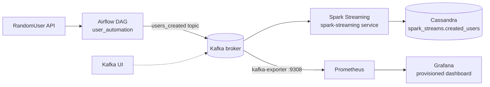

# End-to-End Data Streaming Lifecycle (2026 Edition)

📄 Versión en español disponible en [README.es.md](README.es.md)

[](https://sonarcloud.io/summary/new_code?id=Rubenpombo_end-to-end-data-pipeline)
[](https://github.com/Rubenpombo/end-to-end-data-pipeline/actions/workflows/ci.yml)

## **Summary**
This project demonstrates a professional real-time data pipeline architecture updated for **2026 standards**. It captures user data from an external API, streams it through **Apache Kafka**, processes it with **Apache Spark Streaming**, and stores the results in **Apache Cassandra**. 

The entire stack is containerized with **Docker** (including the Spark streaming job), orchestrated by **Apache Airflow 3.x**, and features a modern observability layer with **Kafka UI**, **Prometheus**, and **Grafana**.

## **Quick demo (5 minutes)**

**Requirements:** Docker, ~4 GB RAM free, ports `8080`, `9092`, `9042`, `3000`, and `8000` available.

```bash
git clone https://github.com/Rubenpombo/end-to-end-data-pipeline.git
cd end-to-end-data-pipeline
make up && make ps    # wait until services report healthy
```

1. Open [Airflow](http://localhost:8080) (`admin` / `admin`) → enable the `user_automation` DAG → trigger a run.
2. Open [Kafka UI](http://localhost:8000) → topic `users_created` → confirm messages appear (~2 msg/s for 120 s).
3. Open [Grafana](http://localhost:3000) (`admin` / `admin`) → *Pipeline Overview* dashboard.

The `spark-streaming` service starts with the stack and writes rows to `spark_streams.created_users` in Cassandra. Run `make test` anytime for unit tests (no Docker required).

## **Architecture**



The Airflow DAG is a **bounded-streaming demo**: each run fetches random users and produces them to Kafka for a 120-second window (~2 msg/s). The Spark job runs continuously as a Docker service, consuming the topic and writing to Cassandra.

### **Data contract**
All layers agree on a single contract for the `users_created` topic. The `address` field travels as a **nested JSON object** (street, city, state, country, postcode, coordinates, timezone), Spark parses it with the full struct schema and serializes it with `to_json()` so it lands as a **JSON string** in the `address TEXT` Cassandra column.

### **Cassandra data model**
- **Primary key:** `id` (UUID from the source API) — point lookups by user ID.
- **Partitioning:** one row per user ID; `SimpleStrategy` with RF=1 is for local demo only.
- **Lineage:** `ingested_at` is set by Spark at processing time (not part of the Kafka message).
- **Access patterns:** streaming inserts by ID. Time-range or country aggregations would need a different partition key or a secondary table — intentionally out of scope for this demo.

## **Architecture & Technologies**

### **Core Data Stack**
- **Apache Airflow 3.1.7**: Pipeline orchestration and data ingestion from RandomUser API.
- **Apache Kafka 7.9 (Confluent)**: High-throughput distributed messaging system.
- **Apache Spark 4.0.2**: Real-time stream processing and data transformation.
- **Apache Cassandra 5.0**: Distributed NoSQL database for final data storage.

### **Observability & Quality**
- **Kafka UI**: Visual management of topics, consumers, and messages ([localhost:8000](http://localhost:8000)).
- **Prometheus & Grafana**: Metrics collection with a pre-provisioned *Pipeline Overview* dashboard ([localhost:3000](http://localhost:3000)).
- **SonarCloud**: Continuous code quality and security analysis.
- **GitHub Actions**: Automated CI/CD pipeline with Ruff linting and Pytest.

## **Execution Guide**

All common tasks are wrapped in the `Makefile`. Environment variables are documented in [`.env.example`](.env.example) — the defaults work out of the box.

1. **Start the Infrastructure**:
   ```bash
   make up        # equivalent to: docker compose up -d (or docker-compose)
   ```

2. **Verify Service Health**:
   Wait a few seconds for all services to be healthy. You can check the status:
   ```bash
   make ps        # equivalent to: docker compose ps (or docker-compose)
   ```

3. **Run Automated Tests**:
   ```bash
   make test      # unit tests (pytest -m "not integration"), same subset as CI
   ```
   Integration tests require the stack running and internet access:
   ```bash
   make test-integration
   ```

4. **Activate Data Ingestion (Airflow)**:
   - Access Airflow at [http://localhost:8080](http://localhost:8080) (User: `admin` / Pass: `admin`, demo-only credentials).
   - Activate the `user_automation` DAG.
   - Monitor incoming messages in **Kafka UI**: [http://localhost:8000](http://localhost:8000).

5. **Spark Streaming**:
   The `spark-streaming` service starts automatically with the stack and submits the job to `spark-master`. To run it on the host instead (e.g. for development):
   ```bash
   pip install -r requirements.txt
   make stream-local   # sets CASSANDRA_HOST/KAFKA_HOST/SPARK_MASTER_URL for the host
   ```

6. **Visualize Data**:
   - **System Metrics (Grafana)**: Visit [http://localhost:3000](http://localhost:3000) (User: `admin` / Pass: `admin`). The *Pipeline Overview* dashboard is provisioned automatically and shows Prometheus target health and scrape latency.

## **Project Structure**
   ```bash
.
├── .github/workflows/         # CI/CD Pipeline (GitHub Actions)
├── dags/                      # Airflow DAGs (Ingestion logic)
├── grafana/                   # Provisioned Grafana dashboards + provider config
├── script/                    # Docker entrypoints
├── tests/                     # Unit (mocked) & integration tests
├── docker-compose.yml         # Container orchestration (Full Stack)
├── Dockerfile-spark           # Custom Spark 4.0.2 image (master/worker/streaming)
├── Makefile                   # Single entry point (up, test, stream-local, ...)
├── .env.example               # Documented environment variables
├── pytest.ini                 # Test markers (unit vs integration)
├── prometheus.yml             # Metrics collection config
├── grafana_datasource.yml     # Automated Grafana datasource
├── requirements.txt           # Consolidated dependencies (host development)
├── requirements-airflow.txt   # Minimal deps installed in the Airflow containers
└── spark_stream.py            # Spark 4.x streaming logic
```
