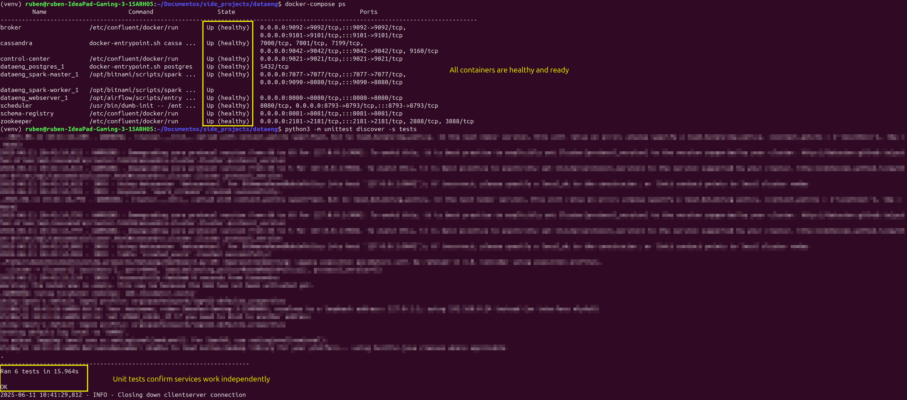
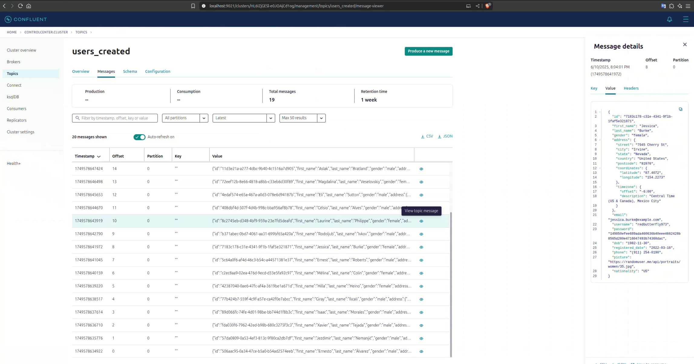

# End-to-End Data Streaming Lifecycle

📄 Versión en español disponible en [README.es.md](README.es.md)

## **Summary**
This project demonstrates the complete lifecycle of data streaming, from data ingestion to visualization. It captures user data from an external API, processes it in real-time using **Apache Kafka** and **Apache Spark**, stores it in a **Cassandra** database, and visualizes it through an interactive dashboard built with **Flask** and **Plotly**. The pipeline is orchestrated using **Apache Airflow**, ensuring automation and reliability.

<p align="center">
  
</p>

The goal of this project is to showcase my ability to design, develop, and maintain robust data pipelines while providing clear and impactful visualizations for decision-making.


## **Technologies Used**

-  **Docker Compose**: Manages the deployment of all services in isolated containers for easy setup and scalability.

-  **Apache Airflow**: Orchestrates the entire pipeline, automating the execution of tasks.

-  **Apache Kafka**: Used for real-time data ingestion and streaming.

-  **Apache Spark**: Processes the data in real-time, transforming and structuring it for storage.

-  **Cassandra**: Serves as the storage layer for processed data, leveraging its distributed NoSQL capabilities.

-  **Grafana**: Provides a powerful and interactive dashboard for visualizing real-time data stored in Cassandra.


## Automation with Make

To simplify the execution process, you can use the `Makefile` included in the project:

- **Setup and Start**: Sets up the environment, starts containers, runs tests, and activates the Airflow DAG.
  ```bash
  make all
  ```

- **Run Streaming Job**: Starts the Spark streaming process (run in a separate terminal).
  ```bash
  make stream
  ```

- **Stop Services**:
  ```bash
  make down
  ```

Run `make help` to see all available commands.

## Execution

1. **Start the required services with Docker Compose**:
   ```bash
   docker-compose up -d
   ```

2. **Set up local environment**:
   Create and activate the virtual environment, then install dependencies:
   ```bash
   python3 -m venv venv
   source venv/bin/activate
   pip install -r requirements.txt
   ```

3. **Run unit tests**:
   ```bash
   python3 -m unittest discover -s tests
   ```
   


4. **Activate the Airflow DAG**:
   - Access the Airflow interface at [http://localhost:8080](http://localhost:8080).
   - Look for the DAG named `user_automation` and activate it so Kafka starts receiving data.
   - Check the messages arriving at the topic from the Confluent Control Center at [http://localhost:9021](http://localhost:9021).
      

5. **Start real-time data processing with Spark**:
   Open a new terminal, activate the environment, and run the script:
   ```bash
   source venv/bin/activate
   python3 spark_stream.py
   ```

6. **Connect to Cassandra**:
   ```bash
   docker exec -it cassandra cqlsh
   ```

   Useful commands inside `cqlsh`:
   ```sql
   DESCRIBE KEYSPACES;
   USE spark_streams;
   DESCRIBE TABLES;
   SELECT * FROM created_users LIMIT 10;
   ```

7. **Access the Grafana Dashboard**:
   Open your browser and go to: [http://localhost:3000](http://localhost:3000).
   
   - **Username**: `admin`
   - **Password**: `admin`

   The dashboard "User Registration Dashboard" should be available in the default folder.


## Structure
   ```bash
dataeng-project/
├── dags/                      # Airflow DAGs
│   └── kafka_stream.py        
├── grafana/                   # Grafana configuration
│   ├── dashboards/            # Dashboard JSON definitions
│   └── provisioning/          # Provisioning for dashboards and datasources
├── script/                   # Utility scripts
│   └── entrypoint.sh         
├── tests/                    # Unit tests for the project
│   ├── test_api_health.py     
│   ├── test_cassandra.py      
│   ├── test_spark_stream.py   
├── venv/                     # Virtual environment
├── docker-compose.yml        # Docker Compose configuration for services
├── Dockerfile-spark          # Dockerfile for Spark setup
├── README.es.md              # Project documentation in Spanish
├── README.md                 # Project documentation in English
├── requirements.txt          # Python dependencies
└── spark_stream.py           # Spark streaming logic
```