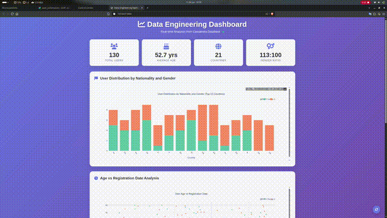

# End-to-End Data Streaming Lifecycle (2026 Edition)

📄 Versión en español disponible en [README.es.md](README.es.md)

[](https://sonarcloud.io/summary/new_code?id=Rubenpombo_end-to-end-data-pipeline)
[](https://github.com/Rubenpombo/end-to-end-data-pipeline/actions/workflows/ci.yml)

## **Summary**
This project demonstrates a professional real-time data pipeline architecture updated for **2026 standards**. It captures user data from an external API, streams it through **Apache Kafka**, processes it with **Apache Spark Streaming**, and stores the results in **Apache Cassandra**. 

The entire stack is containerized with **Docker**, orchestrated by **Apache Airflow 3.x**, and features a modern observability layer with **Kafka UI**, **Prometheus**, and **Grafana**.

<p align="center">
  
</p>

## **Architecture & Technologies**

### **Core Data Stack**
- **Apache Airflow 3.1.7**: Pipeline orchestration and data ingestion from RandomUser API.
- **Apache Kafka 7.9 (Confluent)**: High-throughput distributed messaging system.
- **Apache Spark 4.0.2**: Real-time stream processing and data transformation.
- **Apache Cassandra 5.0**: Distributed NoSQL database for final data storage.

### **Observability & Quality**
- **Kafka UI**: Visual management of topics, consumers, and messages ([localhost:8000](http://localhost:8000)).
- **Prometheus & Grafana**: System metrics collection and visual dashboards ([localhost:3000](http://localhost:3000)).
- **SonarCloud**: Continuous code quality and security analysis.
- **GitHub Actions**: Automated CI/CD pipeline with Ruff linting and Pytest.

## **Execution Guide**

1. **Start the Infrastructure**:
   ```bash
   docker-compose up -d
   ```

2. **Verify Service Health**:
   Wait a few seconds for all services to be healthy. You can check the status:
   ```bash
   docker-compose ps
   ```

3. **Run Automated Tests**:
   ```bash
   python3 -m unittest discover -s tests
   ```

4. **Activate Data Ingestion (Airflow)**:
   - Access Airflow at [http://localhost:8080](http://localhost:8080).
   - Activate the `user_automation` DAG.
   - Monitor incoming messages in **Kafka UI**: [http://localhost:8000](http://localhost:8000).

5. **Start Spark Streaming**:
   ```bash
   # Ensure you have the requirements installed
   pip install -r requirements.txt
   export CASSANDRA_HOST=localhost
   export KAFKA_HOST=localhost:9092
   python3 spark_stream.py
   ```

6. **Visualize Data**:
   - **Business Dashboard (Flask)**: Run `python3 dashboard.py` and visit [http://localhost:5000](http://localhost:5000).
   - **System Metrics (Grafana)**: Visit [http://localhost:3000](http://localhost:3000) (User: `admin` / Pass: `admin`).

## **Project Structure**
   ```bash
.
├── .github/workflows/         # CI/CD Pipeline (GitHub Actions)
├── dags/                      # Airflow DAGs (Ingestion logic)
├── script/                    # Docker entrypoints
├── tests/                     # Unit & Integration tests
├── dashboard.py               # Flask/Plotly visualization app
├── docker-compose.yml         # Container orchestration (Full Stack)
├── Dockerfile-spark           # Custom Spark 4.x image
├── prometheus.yml             # Metrics collection config
├── grafana_datasource.yml     # Automated Grafana setup
├── requirements.txt           # Consolidated dependencies
└── spark_stream.py            # Spark 4.x streaming logic
```
